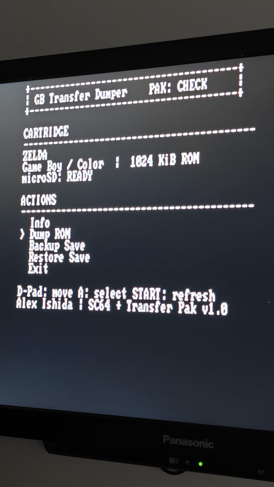
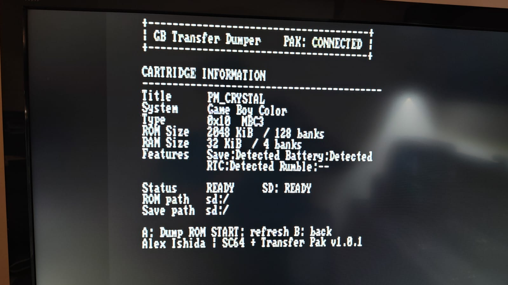
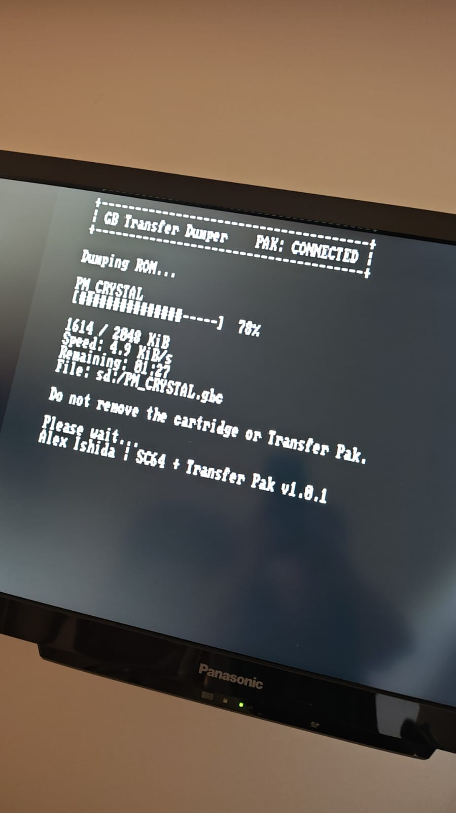
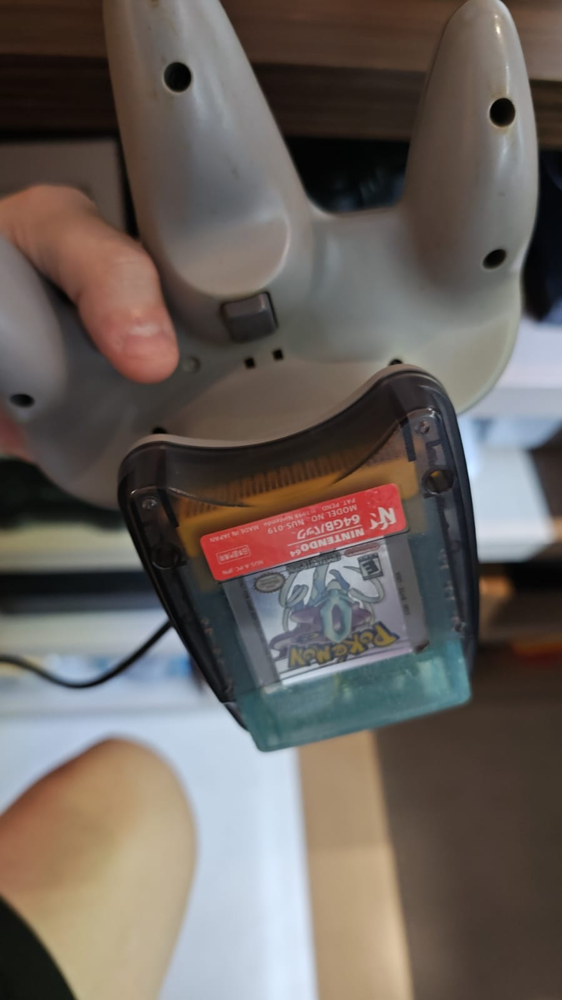
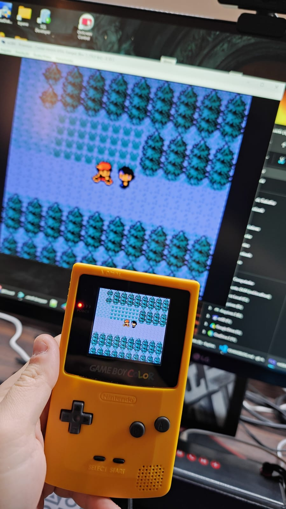

# GB Transfer Dumper

<p>
  
  
  
  
  
</p>

Created by Alex Ishida.

An N64 homebrew utility that copies ROM and RAM from a Game Boy or Game Boy
Color cartridge to a SummerCart64 microSD card through a Transfer Pak.

The menu provides:

- `Info`: re-reads the cartridge and displays its title, system, mapper, type,
  ROM/RAM capacities, and detected save, battery, RTC, and rumble support;
- `Dump ROM`: creates a `.gb` or `.gbc` dump, depending on the cartridge;
- `Backup Save`: creates a `.sav` backup when the cartridge has RAM;
- `Restore Save`: writes a compatible `.sav` file back to the cartridge after
  an explicit overwrite confirmation;
- `Exit`: asks for confirmation, powers down the Transfer Pak, and exits the
  program.

## Interface

The high-contrast console interface is designed for CRTs and modern displays.
The main screen shows cartridge and microSD status beside the available actions;
the `Info` screen is a cartridge card with title, system, mapper, ROM/RAM
capacity, and detected features. Press `A` in `Info` to start a ROM dump or
`START` to read the cartridge again. `START` from the main menu refreshes both
the cartridge and microSD state. All write operations require confirmation.

Dump, backup, and restore screens show a 20-segment progress bar, percentage,
transferred size, current transfer speed, estimated remaining time, and target
path. The interface identifies the application as **GB Transfer Dumper v1.0.2**
by Alex Ishida.

ROM dumps are written to `sd:/romdump` when that directory already exists;
save backups and restores use `sd:/savedump` when it exists. Existing
directories are detected by listing the card, so an empty directory is used
just as well as a populated one. Current libdragon SD filesystem builds cannot
create directories, so an operation automatically writes to or reads from
`sd:/` when its respective directory is absent. Create both directories on the
microSD card to keep ROMs and saves organized.

Existing dumps are never overwritten: the program first tries `TITLE.ext`,
then `TITLE-01.ext`, and so on. A partial file is removed if reading or writing
fails. Save restoration scans the active save location for a `.sav` file,
verifies that its size matches the inserted cartridge's RAM, and then asks for
confirmation before overwriting the cartridge save. When several `.sav` files
are present, a backup this program created for the inserted cartridge
(`TITLE.sav` or `TITLE-NN.sav`) is preferred; otherwise the first `.sav` the
filesystem returns is used. The extension is matched case-insensitively.

## Safety and reliability

- Cartridge presence, power and readiness are verified by libtrpak on both
  sides of every 32-byte transaction, so a cartridge pulled out mid-transfer
  aborts the operation instead of filling the file with whatever the bus
  returned;
- a Transfer Pak reset during a transfer re-selects the affected bank, re-opens
  cartridge RAM and repeats the block that was in flight; repeated resets end
  the operation with a readiness timeout rather than a silently wrong file;
- the application streams every transfer through a 4 KiB file buffer, so it
  does not need to hold a complete ROM in N64 memory;
- failed ROM or save backups remove their incomplete output file whenever
  possible;
- save restore rejects cartridges without RAM and incompatible file sizes,
  accepts standard 44-byte or 48-byte emulator RTC trailers on RTC cartridges,
  restores only the SRAM payload, and verifies every block after writing it;
- debug logging for transfer, filesystem, and hardware errors is available
  when the program is built with `ENABLE_DEBUG`.

## Hardware

- Nintendo 64;
- SummerCart64 with a microSD card;
- Nintendo 64 controller connected to port 1 to drive the menus;
- Transfer Pak (NUS-019) in any controller port: `Info` probes ports 1-4, so
  the Transfer Pak can stay safely in a spare port while port 1 navigates;
- Game Boy or Game Boy Color cartridge.

Do not remove the cartridge or Transfer Pak while an operation is in progress.

## Source layout

| File | Responsibility |
| ---- | -------------- |
| `src/main.c` | Menu, information screen, and the dump/restore flows. |
| `src/cart.c` | Transfer Pak power lifecycle and cartridge metadata. |
| `src/storage.c` | microSD mounting, dump directories, file naming and lookup. |
| `src/transfer.c` | libtrpak streaming backend: ROM dump, save backup, save restore. |
| `src/ui.c` | Console screens, controller input, progress rendering. |
| `src/app.c` | Error strings and debug logging shared by the modules. |

The Makefile compiles every `src/*.c`, so a new module needs no build changes.

## Stack and dependencies

- [libdragon](https://github.com/DragonMinded/libdragon), supplied by the N64
  toolchain;
- [libtrpak](https://github.com/alexishida/libtrpak), downloaded by the
  Makefile and pinned to commit `4a55f4d567ee0cbbf805982089fdd5d325a72617`.

The Makefile downloads libtrpak into `.deps/libtrpak` on the first build.
The entire `.deps/` directory is generated locally and is intentionally ignored
by Git.

Transfers are performed by libtrpak's bulk helpers, with each 32-byte block
routed to or from the microSD card through the streaming callbacks in
`src/transfer.c`. The program therefore does not keep an entire ROM in RDRAM,
does not require an Expansion Pak for 4 or 8 MiB dumps, and inherits libtrpak's
bank traversal, mapper limits, reset recovery and MBC2 nibble handling instead
of reimplementing them.

## Installing libdragon (Linux / WSL2)

This project expects a native libdragon installation with `N64_INST` set. The
following follows the official [libdragon installation guide](https://github.com/DragonMinded/libdragon/wiki/Installing-libdragon)
using its prebuilt MIPS64 toolchain.

1. Install the host build prerequisites:

   ```sh
   sudo apt-get update
   sudo apt-get install build-essential git
   ```

2. Download the current `gcc-toolchain-mips64-*.deb` package from the
   [libdragon releases page](https://github.com/DragonMinded/libdragon/releases),
   then install it:

   ```sh
   sudo dpkg -i /path/to/gcc-toolchain-mips64-*.deb
   ```

3. Open a new terminal, then build and install libdragon itself:

   ```sh
   git clone https://github.com/DragonMinded/libdragon.git
   cd libdragon
   ./build.sh
   ```

4. Confirm that the environment is available:

   ```sh
   echo "$N64_INST"
   test -f "$N64_INST/include/n64.mk"
   ```

The `N64_INST` variable is configured by the toolchain package. If either
verification command fails, open a new shell and consult the official guide.

## Building

```sh
cd /path/to/gb-transf-dumpper
make
```

The output will be created as `gb-transf-dumper.z64`. Copy it to the
SummerCart64 microSD card and run it from the flashcart menu.

To clean only build artifacts while keeping the downloaded dependency:

```sh
make clean
```

## libtrpak limitations

- MMM01, MBC4, TAMA5, and HuC3 are decoded and named on the information screen,
  but have no banking implementation and are refused for dumping;
- a header declaring more banks than its mapper can select is refused before
  any data moves, instead of producing a truncated or duplicated image: ROM
  beyond 2 banks without an MBC, 16 on MBC2, 64 on HuC1, the Game Boy Camera
  and MBC1M, 128 on MBC1 and MBC3, 512 on MBC5; save RAM beyond 1 bank on MBC2
  and MBC1M, 4 on MBC1 and HuC1, 8 on MBC3 and rumble MBC5, 16 on MBC5 and the
  Game Boy Camera;
- 1 MiB MBC1 multicarts are recognised by probing for the repeated header at
  bank `0x10` and traversed with the MBC1M layout; their save RAM is limited to
  the single fixed bank that wiring exposes;
- a cartridge whose type byte claims RAM while its size code is `0` is treated
  as RAM-less: the ROM is still dumped, and the save entries report that there
  is no save RAM;
- Game Boy Camera and HuC1 remain experimental paths;
- RTC and rumble are detected only; they are not separately backed up or
  restored;
- `Restore Save` prefers a `.sav` that this program created for the inserted
  cartridge and otherwise falls back to the first `.sav` returned from
  `sd:/savedump` (or `sd:/` when that directory is absent). A save that came
  from another tool, or one renamed by hand, is only matched by size, so
  confirm the displayed path before restoring;
- restoring a save overwrites cartridge RAM. Confirm that the displayed file
  and cartridge are correct before accepting the warning.
